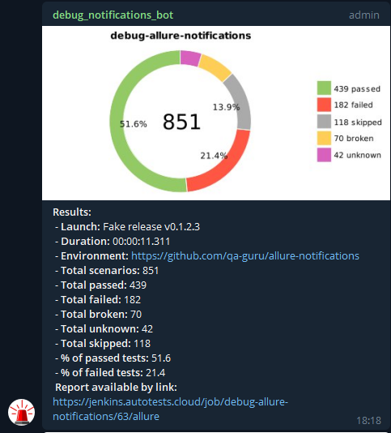

<h1>Allure notifications :sun_with_face:</h1>
<h4>for telegram, slack, email, mattermost</h4>

Just put <b>allure-notifications.jar</b> in your project root and it will draw <u>piechart.png</u> (from `allure-report/widgets/summary.json`) and send it to any messenger! 
<h5>Languages: en, ru, ua </h5>

| Telegram | Slack |
:-------------------------:|:-------------------------:
 | 

<h6>Telegram config</h6>

0. Create telegram bot in @BotFather and add it to your telegram chat. 
Remember <b>telegram bot secret</b> 
Remember <b>telegram chat id</b>, you can find here -> https://api.telegram.org/bot{telegram_bot_secret}/getUpdates (bot needs admin rights) 
1. Download latest release https://github.com/qa-guru/allure-notifications/releases or build .jar yourself:  
`gradle jar` -> build/libs/allure-notifications-*.jar  
2. Put allure-notifications-*.jar in your in your autotests project root (sorry, but kiss).  
3. Run it after allure-report is generated, 
for example Jenkins postbuild task (Post build plugin required https://plugins.jenkins.io/postbuild-task/):  

`java -jar allure-notifications-2.2.1.jar -Dchat.id=XXXXXX -Dbot.token=XXXXXXXXX -Dproject.name=${JOB_BASE_NAME} -Dbuild.report.link=${BUILD_URL}" -Dbuild.launch.name="Fake release v0.1.2.3" -Dallure.report.folder=./allure-report/ " -Dlaunch.name=Allure-notifications-release 2.1 -Denv=https://github.com/qa-guru/allure-notifications -Denable.chart=true -Dlang=en -Dmessenger=telegram  -Dbuild.env=https://github.com/qa-guru/allure-notifications`  

- [x] Telegram config
- [ ] Slack config
- [ ] Email config

<h6>CommandLine options</h6>
All keys should be used with `-D`:   
`build.launch.name - Set build launch name`  
`build.env - Set build environment`  
`build.report.link - Set build report link`  
`lang - Set language (possible values are: ru, en, ua)`  
`enable.chart - Enable/disable PieChart diagram (false by default)`  
`bot.token - Set bot secret token`  
`chat.id - Set chat id`  
`project.name - Set project name`  
`allure.report.folder - Set allure report folder`  
`messenger - Set target messenger (possible values are: telegram, slack, mattermost)`  
`mattermost.api.url - Set mattermost api url`  
Pay attention, all options (except `enable.chart` and `messenger`) are required. Telegram is a default messenger.
